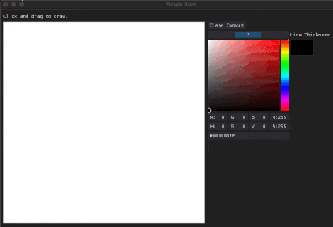
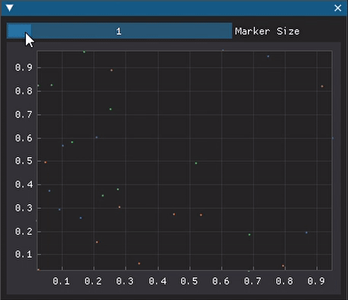
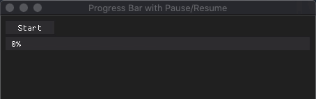
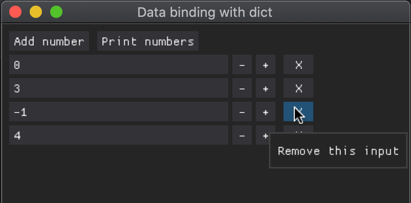

# DearPyGui examples
A collection of example scripts which demonstrate various features/functionality in DearPyGui.

     &nbsp;&nbsp; &nbsp;&nbsp; &nbsp;&nbsp; 

     &nbsp;&nbsp; &nbsp;&nbsp; &nbsp;&nbsp;

## Examples

- [Buttons](#buttons)
- [Data binding](#data-binding)
- [Drawing](#drawing)
    - [Simple paint](#simple-paint)
- [Listbox](#listbox)
- [Menubar](#menubar)
- [Misc](#misc)
- [Persistance](#persistance)
- [Plots](#plots)
- [Sizing](#sizing)
- [Spacing](#spacing)
- [Threading](#threading)
    - [Progress bar](#progress-bar)
- [Window](#window)

## [Buttons](buttons/)

Examples of how to implement various types of buttons. This includes how to implement a button which changes colour when clicked and how to implement nested radio buttons.

## [Data binding](data_binding/)

Examples of how to link a data structure to GUI items so that changes made using the GUI are reflected in the underlying data structure.

## [Drawing](drawing/)

Examples of how to use the drawing API.

### [Simple paint](drawing/simple_paint.py)

A very simple implementation of a paint app. It demonstrates how you can click and drag the mouse on a `dpg.add_drawlist` and draw basic free-form lines using `dpg.draw_line`.

## [Listbox](listbox/)

Examples of custom listbox widgets which extend the functionality of the default listbox. Includes how to implement a listbox which is unselected by default and how to respond to key presses.

## [Menubar](menubar/)

Examples of how to implement all the different types of menubar and how to implement a right-aligned menubar.

## [Misc](misc/)

Miscellaneous examples.

## [Persistance](persistance/)

Examples of how to save and load the state of a GUI. This includes the values of GUI items, the position of windows, etc. A simple example using `dict` is shown as well as an approach using `dataclasses`. Both store the app state in a JSON file.

## [Plots](plots/)

Examples of how to implement various features in plots. Such as enforcing axes limits and updating colours and marker styles.

## [Sizing](sizing/)

Examples of how to size/re-size GUI items. There are some quirks with sizing - mainly to do with getting the correct size of an item on startup.

## [Spacing](spacing/)

Examples of how to space GUI items using different methods. This includes automatic spacing, spacing using a grid of child windows and spacing using tables.

## [Threading](threading/)

Examples of how to use threading in DearPyGui. Includes a start/stop button which can be used to start/stop a thread and a progress bar to show the progress of a task.

### [Progress bar](threading/progress_bar.py) 

A basic progress bar with a start button. Once running, the start button changes to a pause button. The task can then be paused, upon which the pause button changes to a resume button and a reset button appears. 

## [Window](window/)

Examples of how to manage windows. This includes how to create a window which is always on top and how to drag the viewport when `decorated=False`. Also includes restricting the position of a window and how to implement a clicked handler for child windows.
